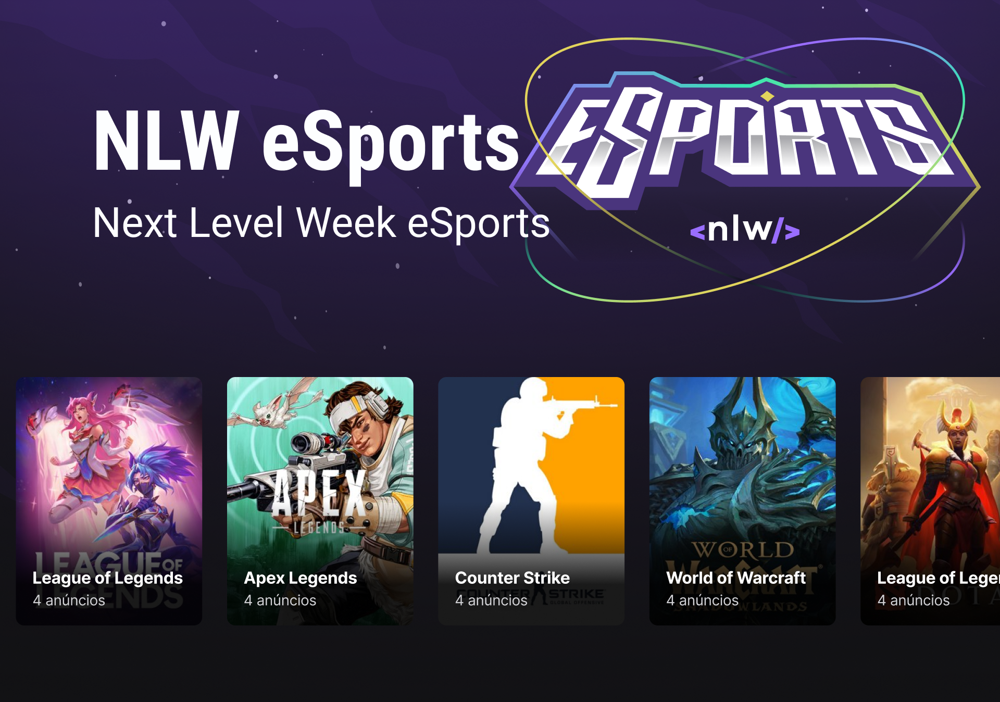

<<<<<<< HEAD
Portifolio iniciantes "Assistente de configuração para games"
Assistente de Configurações de Games com IA 🎮✨ Este projeto é um Assistente de Configurações de Games inovador, desenvolvido para ajudar gamers a otimizar suas experiências de jogo. Utilizando o poder da Inteligência Artificial, nosso assistente sugere as melhores configurações para diversos jogos, garantindo desempenho ideal e gráficos incríveis, tudo adaptado ao seu hardware e preferências.

🌟 Recursos Principais Recomendações Inteligentes: Através de algoritmos de IA, o assistente analisa seu sistema e o jogo escolhido para sugerir configurações personalizadas.
=======
# Portifolio iniciantes "Assistente de configuração para games"

Assistente de Configurações de Games com IA 🎮✨
Este projeto é um Assistente de Configurações de Games inovador, desenvolvido para ajudar gamers a otimizar suas experiências de jogo. Utilizando o poder da Inteligência Artificial, nosso assistente sugere as melhores configurações para diversos jogos, garantindo desempenho ideal e gráficos incríveis, tudo adaptado ao seu hardware e preferências.

🌟 Recursos Principais
Recomendações Inteligentes: Através de algoritmos de IA, o assistente analisa seu sistema e o jogo escolhido para sugerir configurações personalizadas.
>>>>>>> ad8cd687c0b915d32c7c9371e45429a4a1fd97e6

Otimização de Desempenho: Obtenha o equilíbrio perfeito entre qualidade visual e frames por segundo (FPS).

Suporte a Múltiplos Jogos: Projetado para oferecer suporte a uma variedade de títulos populares, como CS2, Valorant, e muitos outros (com expansão contínua!).

Interface Intuitiva (em desenvolvimento): Uma experiência de usuário simples e direta para obter as configurações rapidamente.

<<<<<<< HEAD
🛠️ Tecnologias Utilizadas Este projeto está sendo construído com foco em JavaScript para a lógica principal e manipulação de dados, aproveitando seus recursos modernos para desenvolvimento robusto e escalável.
=======
🛠️ Tecnologias Utilizadas
Este projeto está sendo construído com foco em JavaScript para a lógica principal e manipulação de dados, aproveitando seus recursos modernos para desenvolvimento robusto e escalável.
>>>>>>> ad8cd687c0b915d32c7c9371e45429a4a1fd97e6

JavaScript (ES6+): Linguagem principal de desenvolvimento.

Inteligência Artificial: Detalhes dos modelos de IA serão adicionados conforme o desenvolvimento avança.

Node.js (para backend, se aplicável): Potencialmente para gerenciar requisições e processamento de dados de IA.

HTML/CSS (para frontend, se aplicável): Para a interface de usuário.

<<<<<<< HEAD
Imagem com estrutura de links pessoais 
=======
 
>>>>>>> ad8cd687c0b915d32c7c9371e45429a4a1fd97e6
